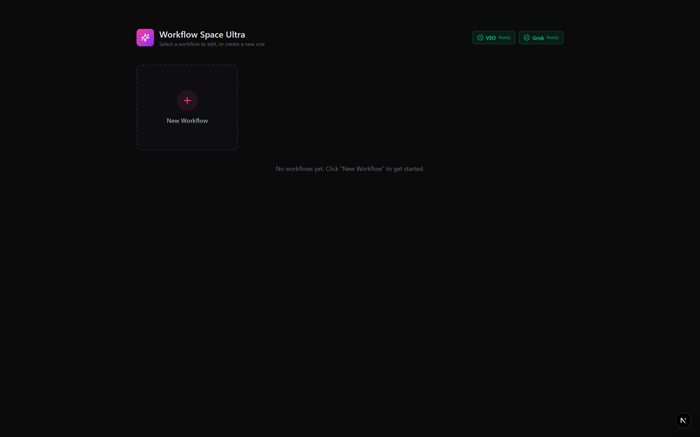
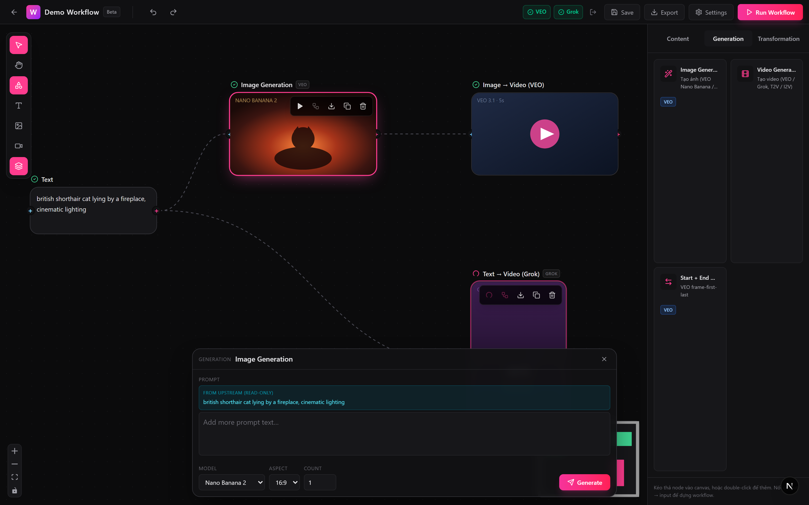
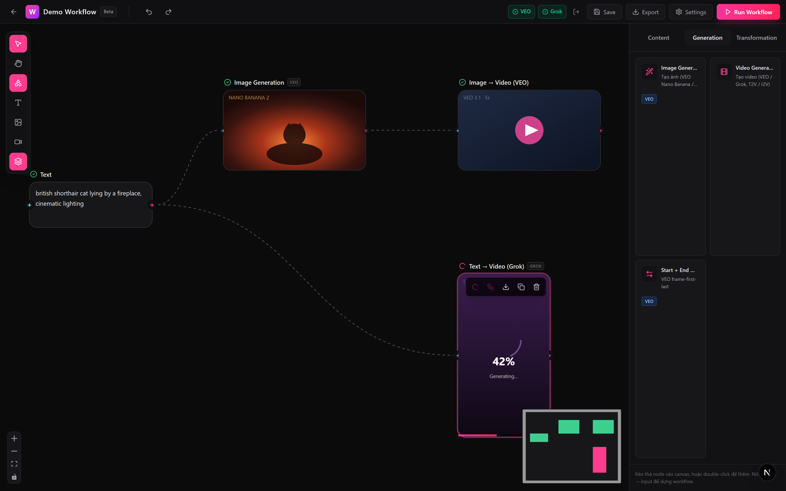
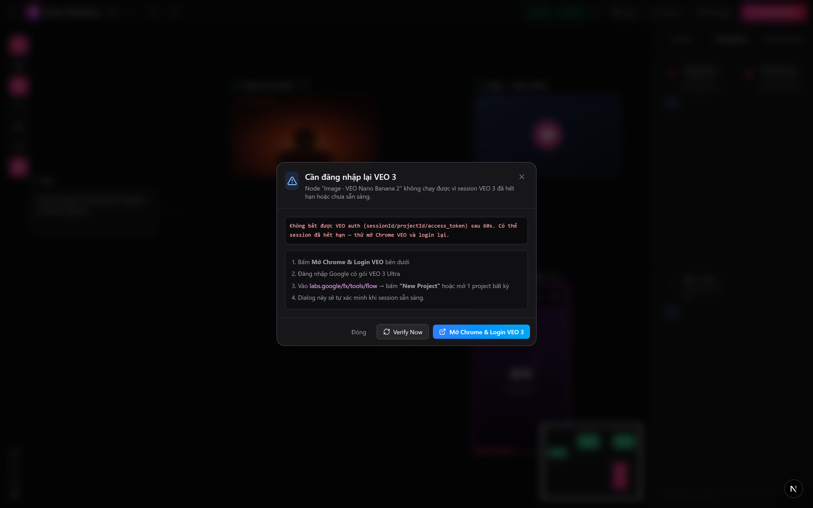

# Workflow Space Ultra

A node-based AI workflow canvas (Picsart Flow / Freepik AI Suite–style) for **VEO 3.1 Ultra** and **Grok Imagine**, running locally and **without any API key** — it reuses your existing browser login sessions.

> ⚠️ This is a personal utility, not an official integration. It relies on browser automation against undocumented endpoints, which means: (1) it may violate ToS if used commercially, (2) accounts can get suspended, (3) endpoints may change at any time. Use at your own risk, ideally with a secondary account.

## Demo

<!-- Hero screenshot — full canvas with a connected workflow -->


<!-- A short GIF/MP4 showing a run end-to-end (text → image → video) -->

<p align="center">
  
</p>

<details>
<summary><strong>More screenshots</strong></summary>

| Multi-workflow dashboard                                       | Node inspector                                              |
| -------------------------------------------------------------- | ----------------------------------------------------------- |
|                  |               |

| Cascading run with progress                                    | Session-error re-login popup                                |
| -------------------------------------------------------------- | ----------------------------------------------------------- |
|          |    |

</details>

## What it does

- Compose AI image/video pipelines visually on an infinite canvas: drop nodes, wire them up, hit run.
- Generate with **VEO 3.1 Ultra** (text→image, text→video, image→video, start+end frame).
- Generate with **Grok Imagine** (text→video, image→video, auto-upscale to HD).
- Manage many separate workflows from a dashboard, all auto-saved locally.

## Highlights

- One-click login flow — sign in once through the in-app Chrome popup, sessions are reused automatically.
- Cascading run — running a downstream node auto-executes any pending upstream nodes first.
- Split run buttons — choose between "run only this node" or "run upstream + this node".
- Text chaining — connect multiple text nodes; downstream nodes merge them into one composite prompt.
- Real-time progress streamed onto each node, with per-provider job queues to respect rate limits.
- Auto re-login popup when a session expires — guides you through the recovery flow.
- Full undo/redo history — `Ctrl/Cmd+Z`, `Ctrl/Cmd+Shift+Z` (or `Ctrl+Y`); drag-as-one-step; safe across progress ticks.
- Quick-add menu — right-click an empty spot on the canvas to spawn a searchable node picker at the cursor (↑/↓/Enter/Esc).
- Dark, minimal Picsart-style UI with edge-to-edge media previews.

## Quick start

```bash
npm install
npm run dev      # http://localhost:3000
```

Handy scripts:

```bash
npm test           # run the Vitest unit suite (lanes, prompt chain, zod, runWorkflow topo, ...)
npm run typecheck  # strict TypeScript check
npm run screenshots # regenerate demo screenshots in docs/screenshots/
```

On first run:

1. Open `http://localhost:3000`.
2. Click the **VEO** badge in the status bar — Chrome opens at `labs.google/flow`. Sign in with your VEO Ultra account.
3. Click the **Grok** badge — Chrome opens at `grok.com`. Sign in with your Grok account.

That's it. Sessions are cached locally; you only need to re-login when they expire (the app prompts you).

## Configuration (optional)

Defaults work out of the box. To override, copy `.env.example` → `.env.local` or use the in-app **Settings** dialog.

### Debugging undocumented VEO endpoints

If VEO/Flow changes its payload schema and calls start returning `400 Unknown name "…" at "…"`, enable **capture mode** to record the real payload that labs.google's UI sends and compare it against what the tool sends:

```powershell
$env:VEO_CAPTURE_PAYLOADS="1"; npm run dev
```

Then perform the action in the labs.google tab that the tool keeps open (upload a reference image, hit Generate, …). Every intercepted `batchGenerateImages` / `batchAsync*` request is logged as a `[VEO CAPTURE]` block in the terminal — URL, full request body, no truncation. The requests are still short-circuited with `403` so nothing actually fires against your quota. Unset the env var to return to normal run mode.

## License

Private / personal use only.
